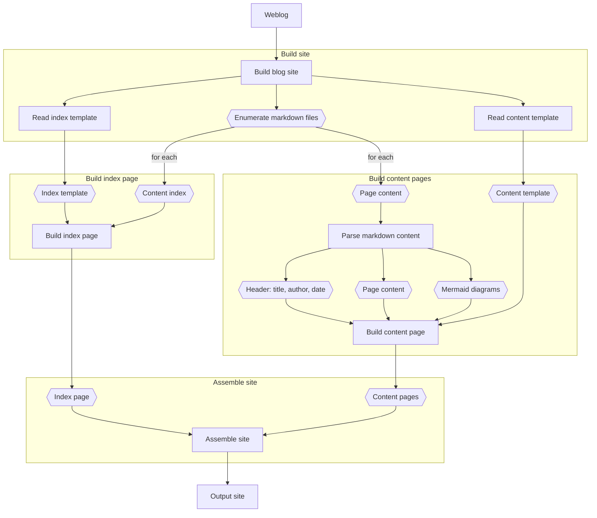

# Markdown Weblog

Create a static blog site from markdown files.

Includes support for mermaidjs.

## Architecture

Uses two html templates (one for index, another for a post) to build a static
HTML site from Markdown content. Apply whatever styling is necessary via CSS
in the template files. The content of posts, title, date, and author will be
replaced within the template file during generation. Very simple.

### Design

The following diagram illustrates the basic workflow used to assemble the blog
site.

### Libraries

This package uses the following libraries:

* [Marked](https://www.npmjs.com/package/marked) - Used to parse the markdown
content and convert it to HTML.
* [MermaidJS](https://www.npmjs.com/package/mermaid) - Used to parse mermaid
diagram content and convert it to SVG.
