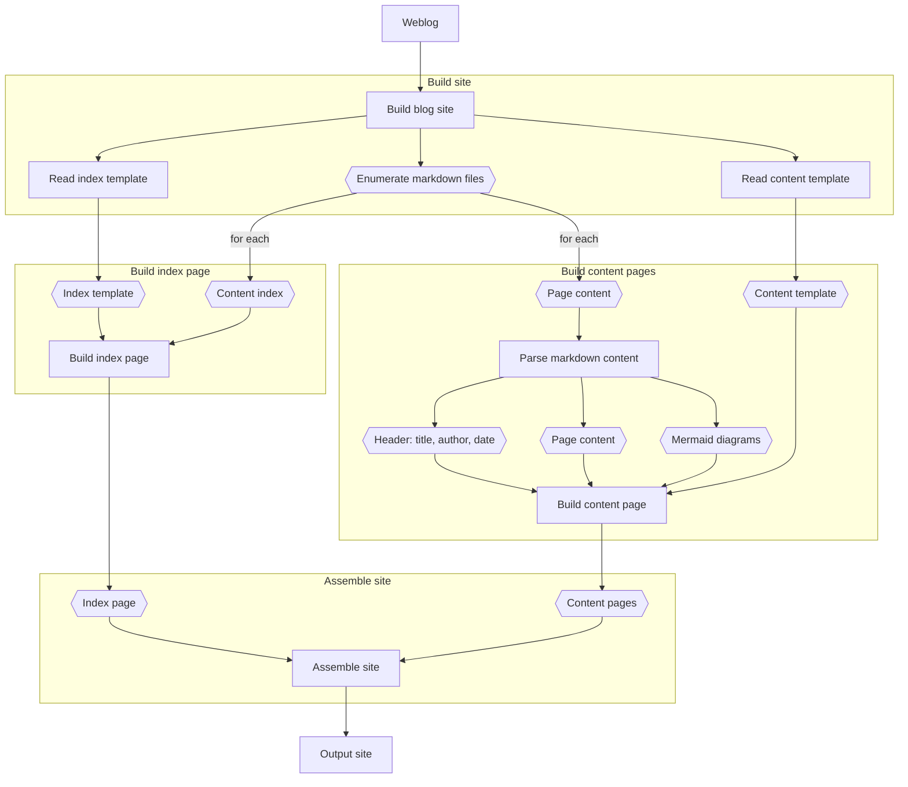

# Stuart Thompson's Blog

This site contains the source and pages for my blog.

### Why don't you use [insert blog software here]?

I've been a WordPress user for years. They provide a fantastic framework for
building rich sites with tons of features. I couldn't hope to begin to build
a tenth of the features they provide.

Yet my needs and use for a blog has changed. I don't interact with others via
a blog anymore. I've never seen it as a source of revenue so I don't show ads.
It started as a place to share thoughts and as a repository for ideas and
notes, or write-ups of projects that held my interest.

I have relieved my blog of many of the duties it once performed, moving notes
to their own repository, images to my photo sharing site, social blurbs to
Twitter, and so on.

What I'd like to achieve with my blog today is very different than what I set
out to achieve when I wrote that first post over two decades ago. As my needs
have changed, I've gone seeking simpler tools that fit more closely with my
workflows.

### What about older posts? Migration?

I have a ton of content on my blog. Most of it is highly irrelevant, even to
me. I've begun migrating my technical notes, which desperately needed
consolidation anyway as they had become scattered between Evernote, gists,
various only code playpens, the blog, and several other sources. Those are
probably the highest value items.

Much of the other material has either already been migrated (e.g. photos) or
just isn't worth retaining as an online presence. I'll keep the database dumps
for my own nostalgia, but otherwise I can't imagine someone finding use from
a write-up of a trip to Hawaii from ten years ago, the content of which is
already duplicated on photo sharing and other social media sites.

## Architecture

Uses two html templates (one for index, another for a post) to build a static
HTML site from Markdown content. Apply whatever styling is necessary via CSS
in the template files. The content of posts, title, date, and author will be
replaced within the template file during generation. Very simple.

### Design

The following diagram illustrates the basic workflow used to assemble the blog
site.

### Libraries

This package uses the following libraries:

* [Marked](https://www.npmjs.com/package/marked) - Used to parse the markdown
content and convert it to HTML.
* [MermaidJS](https://www.npmjs.com/package/mermaid) - Used to parse mermaid
diagram content and convert it to SVG.
